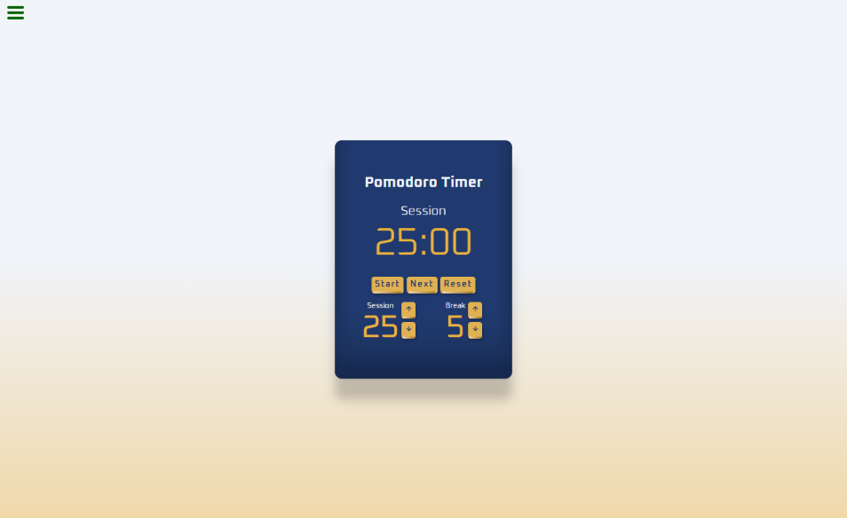

# Pomodoro Timer freeCodeCamp

App construído para um módulo do curso Front End Libraries do freeCodeCamp.

### Funcionalidades:

-   Tempo de sessão e pausa personalizável.
-   Altera a sessão automaticamente.
-   Indicador visual quando o app está rodando.
-   Indicador visual quando o tempo está acabando.
-   Indicador sonoro quando o tempo termina.

## Uso

Opcionalmente, você não precisa instalar. Pode ir à uma versão simplificada no CodePen: https://codepen.io/maykopr/full/vYvOYBg

Mas caso queira baixar e instalar:

1. Tenha certeza que você tem o Node e o Git instalado.
2. Clone este repositório usando `git clone https://github.com/Maykopr/pomodoro-timer-freecodecamp`
3. Vá para o diretório raiz `cd <caminho-da-pasta>`
4. Rode o comando `npm install` para instalar todas as dependências.
5. Rode o comando `npm run dev` para ter um preview, ou utilize qualquer dos scripts Vite no package.json.

## Construído com

## Autor

[Mayko Costa](https://github.com/Maykopr)

## Licensa

This project is licensed under the MIT licence
